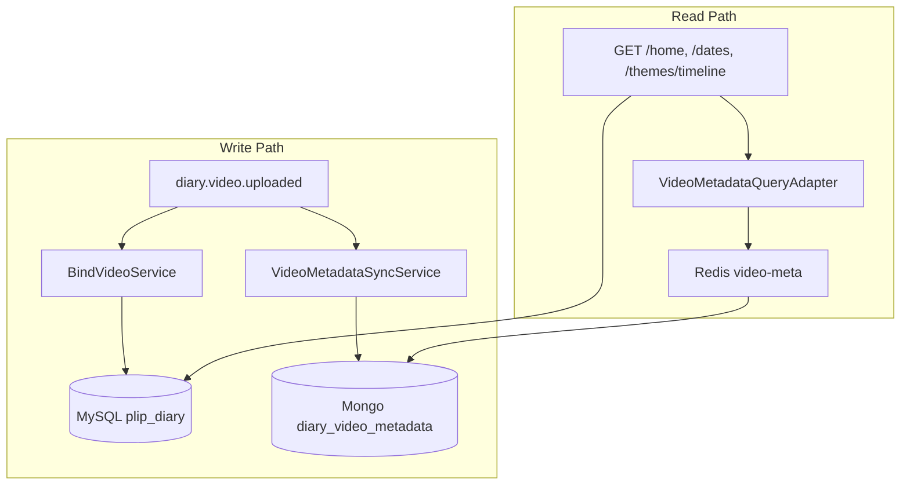

# plip-diary Read Strategy ADR

> Architecture Decision Record — hybrid read model 전략 및 구현 로드맵  
> Status: Accepted (Phase 0~4 구현 완료)

---

## 1. 배경

plip-diary는 MySQL(정본) + Mongo(영상 메타 projection) + Redis(메타 look-aside) + Kafka(EDA) hybrid 구조다.

- 타임라인 **구조**(날짜·테마·videoUuid): MySQL 직접 조회
- **caption/thumbnail**: Mongo `diary_video_metadata` + Redis — GET 시 video-service 동기 HTTP 없음 ([diary-video-metadata.v1.md](../mongodb/diary-video-metadata.v1.md))

100만 사용자 scale 및 projection 정합성을 검토한 결과, **full CQRS 전환은 기각**하고 **현 hybrid 유지 + 단계적 보강**을 채택한다.

---

## 2. 결정 (Decision)

**MySQL-primary Timeline + Metadata Projection CQRS + (부하 시) Timeline Response Cache**

| Read Layer | 대상 | 시점 |
|------------|------|------|
| Meta Redis → Mongo | `/home`, `/dates`, `/themes/timeline` enrichment | **현재** |
| MySQL | 타임라인 구조 | **현재** |
| Timeline Redis | 타임라인 API 응답 캐시 | **부하 확인 후 (Phase 2)** |
| MySQL read replica | MySQL read 분산 | Phase 3, 선택 |

---

## 3. Full CQRS 기각 사유

### 3-1. 타임라인은 관계형 쿼리가 본질

- 홈: userUuid + 365일 range + 날짜 grouping + 테마 join
- 테마 타임라인: cursor pagination (`createdAt DESC, id DESC`)
- Mongo document 이전 시 projection rebuild·range·cursor 복잡도 증가

### 3-2. MySQL만으로 read model rebuild 불가

- `diary_videos`: `video_uuid`, `theme_id`, `created_at`만 저장 ([schema.sql](../sql/schema.sql))
- `caption`, `thumbnail_url`은 Kafka event 경로로만 Mongo 적재
- 타임라인까지 Mongo 이전해도 메타 projection은 별도 유지 → sync surface만 증가

### 3-3. partial CQRS가 핵심 목적 달성

- 목적: cross-service read decoupling (video-service HTTP 제거)
- `VideoMetadataQueryAdapter`: Redis → Mongo look-aside로 달성

### 3-4. 리스크

- Kafka + Mongo + MySQL 3중 write path, lag, backfill 운영비
- 개인 타임라인(userUuid scoped) — Mongo 샤딩 이점 < Redis + MySQL replica

---

## 4. As-Is 아키텍처

---

## 5. To-Be (Phase별)

### Phase 1 — Metadata Projection 견고화 (정합성, **즉시**)

- `ThemeService.deleteTheme`: theme soft-delete 시 Mongo/Redis 메타 batch remove (unbind와 동일 semantics)
- 선택: reconciliation job, video-service fallback (feature flag)

### Phase 2 — Timeline Redis (성능, **구현 완료**)

- `DiaryTimelineCachePort` / `DiaryTimelineRedisAdapter` — home/date/theme timeline cache-aside (TTL 10분)
- SET 기반 index key로 user 단위 evict
- write path(bind/unbind/transfer/theme CRUD) afterCommit evict 연동

### Phase 3 — MySQL index (인프라, **SQL 작성 완료**)

- `idx_video_uuid` on `diary_videos(video_uuid)` — 비디오 중복 체크 최적화
- 100만 규모 시 `user_uuid` 비정규화 + 복합 인덱스 마이그레이션 가이드 (`docs/sql/migrations/`)

### Phase 4 — Observability (**구현 완료**)

- `spring-boot-starter-actuator` + Micrometer
- `diary.timeline.cache` (hit/miss), `diary.video.metadata.cache` (hit/miss) 카운터

---

## 6. Non-Goals

- 타임라인 전체 Mongo read model 이전
- `diary_videos`에 caption/thumbnail MySQL 이중 저장
- GET path MySQL → Mongo full rebuild
- Debezium CDC

---

## 7. API별 Read Stack

| API | 구조 | enrichment | timeline cache |
|-----|------|--------------|----------------|
| `GET /home` | MySQL | Redis → Mongo | O (Phase 2) |
| `GET /dates/{date}` | MySQL | Redis → Mongo | O (Phase 2) |
| `GET /dates/window` | MySQL | Redis → Mongo | X |
| `GET /themes/{id}/timeline` | MySQL | Redis → Mongo | O (Phase 2) |
| `GET /calendar` | MySQL | 없음 | X |
| `GET /themes` | MySQL | 없음 | X |

---

## 8. 구현 우선순위

| 축 | Phase |
|----|-------|
| 정합성·필수 | **Phase 1** |
| 성능·scale | Phase 2~4 |

**착수 순서: Phase 0 (본 문서) → Phase 1 → Phase 2 → Phase 3 → Phase 4 (전체 완료)**

---

## 9. 변경 이력

| 날짜 | 변경 |
|------|------|
| 2026-03-24 | ADR 초안 — full CQRS 기각, hybrid + Phase 로드맵 |
| 2026-09-17 | Phase 2~4 구현 완료 — timeline cache, index SQL, Micrometer 메트릭 |
